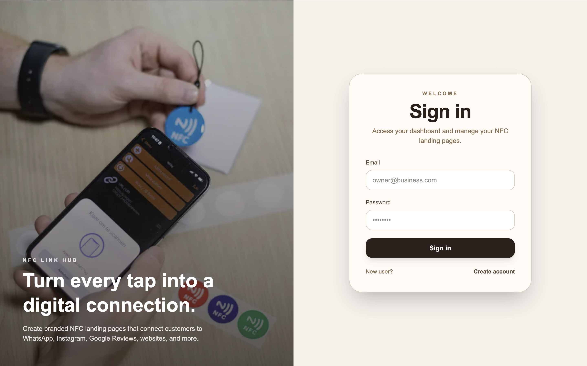
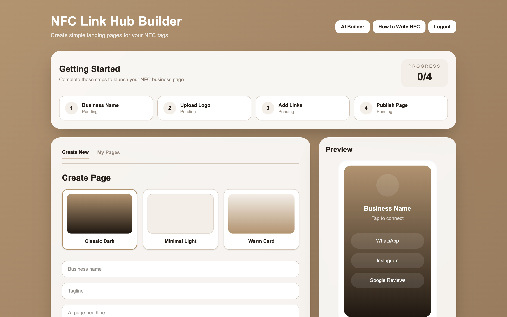
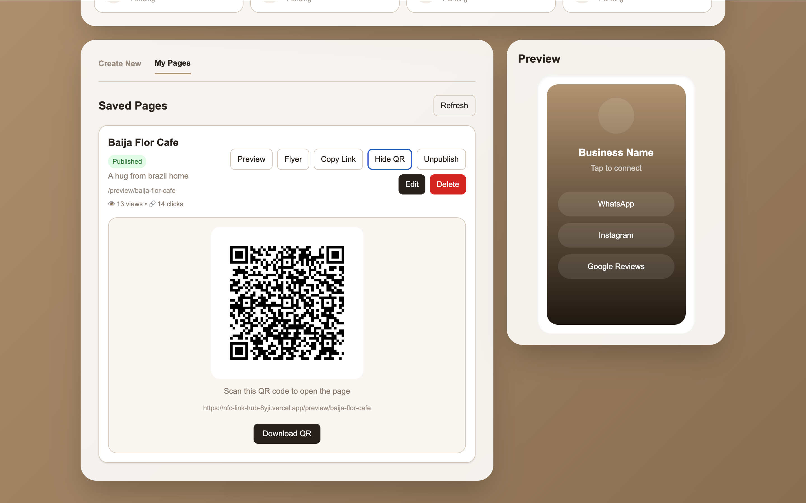

# NFC Link Hub

A web-based digital platform designed to help small businesses create and manage a simple online presence that customers can access through an NFC tag.

This project was developed as my final-year dissertation for my BSc (Hons) Computing degree at Solent University and achieved a mark of 79%.

## About the Project

I developed NFC Link Hub after researching some of the challenges small businesses face when establishing their online presence, particularly when they have limited budgets or technical experience.

The platform allows a business owner to create a personalised landing page containing their business information and social media links. The page can then be associated with an NFC tag, allowing customers to access it by tapping the tag with a compatible device.

Business owners can log in and manage their page without needing to edit code.

## Features

- User registration and authentication
- Create a personalised business landing page
- Add business information and social media links
- Update existing page information
- Delete a business page
- Public customer-facing landing pages
- NFC-compatible page access
- Responsive web interface

## Technologies

- Next.js
- TypeScript
- Firebase Authentication
- Cloud Firestore
- Firebase Admin SDK
- Vercel
- Git & GitHub

## How It Works

1. A business owner creates an account.
2. The owner creates and customises their business landing page.
3. The page is connected to an NFC tag through its URL.
4. A customer taps the NFC tag with a compatible phone.
5. The customer's browser opens the business landing page.
6. The business owner can return to the platform to update or delete their information.

## Project Background

NFC Link Hub was developed between February and June 2026 as my final-year BSc (Hons) Computing dissertation project.

One of the main challenges during development was working with technologies I had limited previous experience with, particularly the application framework and Firebase services. Building the project helped me develop my ability to research technical problems, learn independently and apply unfamiliar technologies to a working application.

## Live Application

A deployed version of the application is available through the repository's website link.

## Screenshots

### NFC-enabled authentication experience
The platform connects physical NFC interactions with digital business landing pages.

### Landing Page Builder
Business owners can create branded landing pages, choose a design template and preview the customer experience before publishing.

### Page Management & QR Sharing
Published pages can be managed from the dashboard, with QR-code sharing and basic engagement analytics for views and link clicks.

## Running Locally

Clone the repository:

git clone https://github.com/RenataBonini/nfc-link-hub.git

Install dependencies:

npm install

Start the development server:

npm run dev

The application requires Firebase configuration to run locally. Environment-specific configuration should be stored locally and should not be committed to the repository.

## Author

Renata Bonini de Sousa

Final Year Computing Project
Southampton Solent University
